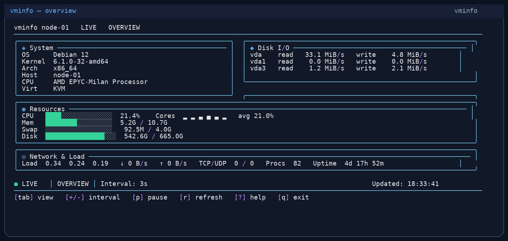
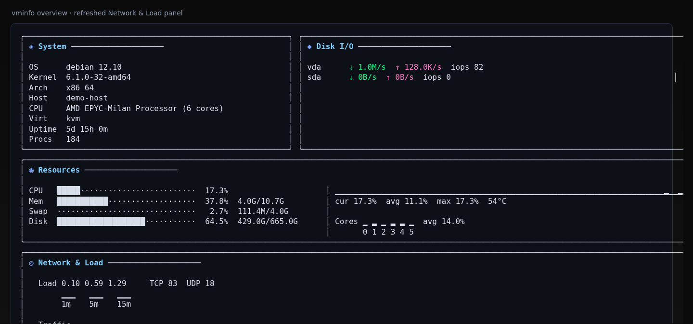
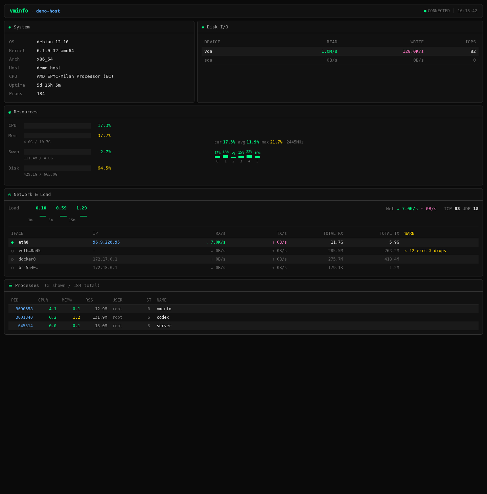
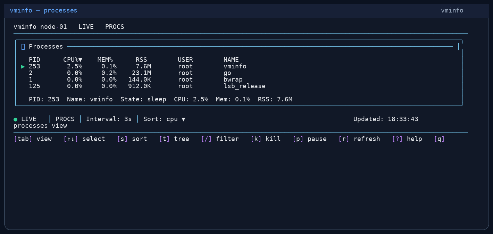
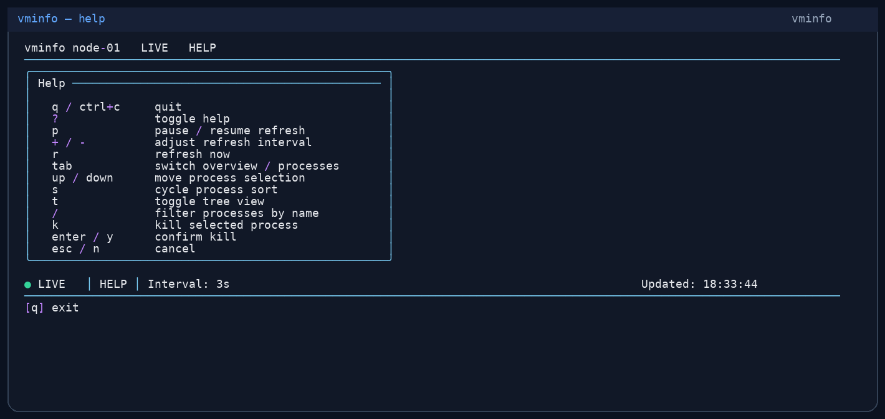

# vminfo — terminal system monitor, web dashboard, and Go library

> Cross-platform system monitoring for Linux, macOS, and Windows. Inspect CPU, memory, disk, network, load, and processes in a polished terminal UI, JSON output, or browser dashboard.

[](https://github.com/cloudapp3/vminfo/actions/workflows/ci.yml)
[](https://pkg.go.dev/github.com/cloudapp3/vminfo)
[](LICENSE)

中文说明：[docs/README.zh-CN.md](docs/README.zh-CN.md)

[Quick start](#quick-start) · [Preview](#preview) · [Join Telegram](https://t.me/VMPulse) · [Open an issue](https://github.com/cloudapp3/vminfo/issues/new) · [Contributing](#contributing)

## Quick start

```bash
# 1. Install — one-line script (Linux/macOS)
curl -fsSL https://raw.githubusercontent.com/cloudapp3/vminfo/main/install.sh | bash

# Or with sudo to install to /usr/local/bin
curl -fsSL https://raw.githubusercontent.com/cloudapp3/vminfo/main/install.sh | sudo bash

# 2. Run — interactive TUI
vminfo

# 3. Or get a JSON snapshot for scripting
vminfo summary --json
```

That's it. No config files, no daemons, no setup.

The install script auto-selects a directory: `/usr/local/bin` → `~/.local/bin` → `~/bin`.

Other install options:

```bash
# Custom directory
curl -fsSL https://raw.githubusercontent.com/cloudapp3/vminfo/main/install.sh | bash -s -- --dir /opt/bin

# Go source build
go install github.com/cloudapp3/vminfo/cmd/vminfo@latest
```

Need help, want to share feedback, or request a feature? Join the [VMPulse Telegram group](https://t.me/VMPulse) or [open an issue](https://github.com/cloudapp3/vminfo/issues/new).

## Why vminfo

vminfo is built for developers, SREs, DevOps engineers, and server operators who want fast, low-friction visibility into host metrics.

Use vminfo when you need to:

- monitor CPU, memory, disk, network, and load from the terminal
- inspect Linux processes quickly without switching tools
- export machine-readable JSON for scripts, CI, or automation
- open a lightweight browser dashboard on a server with `vminfo --web`
- embed host metrics collection into your own Go tools

## Preview



> Screens may vary slightly by terminal width, font, and theme.

| TUI overview | Web dashboard |
| --- | --- |
|  |  |

| Processes | Help |
| --- | --- |
|  |  |

## What it does

vminfo gives you instant visibility into any host:

- **TUI** — full-screen, live-updating terminal dashboard with overview and process views
- **JSON** — machine-readable output for scripts, CI, monitoring pipelines
- **Web dashboard** — browser-based UI with REST and WebSocket endpoints (`vminfo --web`)
- **Go library** — import `github.com/cloudapp3/vminfo` for collection, or `github.com/cloudapp3/vminfo/tui` to embed the interactive terminal UI

Collected metrics: CPU (per-core), memory, swap, disk, disk I/O, network, load, TCP/UDP counts, network interface totals/errors/drops, process list, temperatures, uptime, and host metadata.

## Network & Load panel

- **Load-aware coloring** — 1m / 5m / 15m load values are colored by `load / CPU cores`, with mini bars in wide layouts
- **Traffic split** — total throughput is separated from the per-interface table for faster scanning
- **Interface prioritization** — active interfaces and warning interfaces sort before idle bridges / veth devices
- **Noise reduction** — idle interfaces fold on narrow layouts, while public/private IPs and errors/drops stay visually distinct
- **Web parity** — the web dashboard mirrors the same network semantics: totals, sorting, IP styling, and interface warnings

## Commands

```bash
vminfo                 # launch TUI
vminfo info            # TUI alias
vminfo summary         # one runtime snapshot (text)
vminfo summary --json  # one runtime snapshot (JSON)
vminfo watch           # stream snapshots continuously
vminfo watch --json    # stream JSON lines
vminfo watch --count 1 # single sample then exit
vminfo --web           # web dashboard on 127.0.0.1:20021
vminfo --web --token   # auto-generate a dashboard token
vminfo --web --token secret-token
vminfo --web --tui     # web + TUI together
vminfo --web --bind 0.0.0.0 --port 8080
vminfo ps              # Linux-only process list
vminfo ps --json       # processes as JSON
vminfo ps --sort mem   # sort by cpu|mem|pid|name
vminfo kill <pid>      # SIGTERM a process (Linux)
vminfo update          # check + install the latest tagged release
vminfo update --check  # check without installing
vminfo update --version v0.1.0
vminfo --lang zh       # switch UI language
```

Built-in languages: `en`, `zh`, `de`, `es`, `fr`, `ja`, `ko`, `pt`, `ru`.

## Web dashboard

```bash
vminfo --web                      # default: 127.0.0.1:20021
vminfo --web --token             # auto-generate a token and print a ready-to-open URL
vminfo --web --token my-token    # use a fixed token
vminfo --web --bind 0.0.0.0 --port 8080 --interval 1s
```

Add `--token` when you want to protect the dashboard in a browser:

- `--token some-value` uses that exact token
- bare `--token` auto-generates a URL-safe token
- the first successful `/?token=...` visit sets a cookie, so later page/API/WebSocket requests can continue without keeping the token in the address bar
- `GET /healthz` stays public so local probes and health checks still work

When binding to all interfaces, startup output now shows friendlier URLs instead of only `0.0.0.0`:

```text
Web dashboard:
  Local  http://127.0.0.1:20021
  Public http://203.0.113.10:20021   # when a public IPv4 is present
  LAN    http://192.168.1.23:20021   # fallback when only a LAN IPv4 is present
```

When a token is enabled, the printed URLs include `?token=...` so you can copy/paste them directly:

```text
Web dashboard: http://127.0.0.1:20021/?token=secret-token
```

Web mode keeps stdout quiet during normal browsing: routine HTTP request logs and WebSocket connect/disconnect logs are suppressed, while real startup and error messages are still shown.

With dashboard auth enabled, the web server also tightens browser access rules:

- dashboard pages, JSON APIs, and `/ws` require the token or the auth cookie
- permissive `Access-Control-Allow-Origin: *` is not exposed in token-protected mode
- WebSocket upgrades require the browser origin to match the dashboard host

Endpoints:

- `GET /healthz` — health check
- `GET /api/v1/snapshot` — current snapshot JSON
- `GET /ws` — live WebSocket stream

## Self-update

Release builds can update themselves from GitHub Releases:

```bash
vminfo update
vminfo update --check
vminfo update --version v0.1.0
```

Recent web UI polish:

- Larger overall type scale for easier browser reading
- Resource progress bars use grouped spacing and segmented tracks
- CPU right-side block is vertically centered in the Resources card
- Per-core CPU bars are larger and the extra `avg` footer has been removed

## TUI controls

| Key | Action |
| --- | --- |
| `q` / `ctrl+c` | Quit |
| `?` | Toggle help |
| `p` | Pause / resume |
| `+` / `-` | Adjust interval |
| `r` | Refresh now |
| `tab` | Switch overview / processes |
| `↑` / `↓` | Move selection |
| `s` | Cycle sort |
| `t` | Tree view |
| `/` | Filter processes |
| `k` | SIGTERM selected process |
| `K` | Show / hide Linux kernel threads |
| `enter` / `y` | Confirm kill |
| `esc` / `n` | Cancel |

Status badges: `LIVE` · `PAUSED` · `LOADING` · `ERROR` · `STALE`

## Library usage

Collect host metrics from your own Go program:

```go
package main

import (
    "context"
    "fmt"
    "time"

    "github.com/cloudapp3/vminfo"
)

func main() {
    ctx := context.Background()

    static, _ := vminfo.CollectStatic(ctx)
    stats, _ := vminfo.CollectStats(ctx, vminfo.Options{SampleInterval: time.Second})

    fmt.Println(static.Hostname, stats.CPU)
}
```

Launch the same interactive terminal UI from another Go CLI:

```go
package main

import (
    "context"
    "log"

    vminfotui "github.com/cloudapp3/vminfo/tui"
)

func main() {
    if err := vminfotui.Run(context.Background(), vminfotui.Options{Lang: "en"}); err != nil {
        log.Fatal(err)
    }
}
```

`tui.Options` also accepts custom `Stdin` and `Stdout` streams for embedded CLIs and tests.

Public packages: `github.com/cloudapp3/vminfo` · `github.com/cloudapp3/vminfo/tui`

Exported collection types: `StaticInfo` · `RuntimeStats` · `ProcessInfo` · `Snapshot` · `AppMetadata`

## Platform support

| Capability | Linux | macOS | Windows |
| --- | --- | --- | --- |
| `summary` / `watch` | ✅ | ✅ | ✅ |
| TUI | ✅ | ✅ | ✅ |
| Web dashboard | ✅ | ✅ | ✅ |
| `ps` / `kill` | ✅ | ⚠️ stub | ⚠️ stub |
| `update --check` | ✅ | ✅ | ✅ |
| `update` install | ✅ | ✅ | ⚠️ check-only |

TUI requires a real TTY. `ps` and `kill` are Linux-only by design.

## Community & Support

- 💬 Join the Telegram group: [t.me/VMPulse](https://t.me/VMPulse)
- 🐛 Found a bug or want a feature? [Open an issue](https://github.com/cloudapp3/vminfo/issues/new)
- 📚 Prefer to start with docs? See [Documentation](#documentation)
- 🤝 Want to contribute? Start with [CONTRIBUTING.md](CONTRIBUTING.md)

Feedback, bug reports, and feature requests directly help shape the vminfo roadmap.

## Contributing

Contributions are welcome — bug reports, feature ideas, documentation improvements, tests, platform compatibility fixes, and pull requests.

If you want to help:

1. [Open an issue](https://github.com/cloudapp3/vminfo/issues/new) to discuss a bug, feature, or non-trivial change
2. Read [CONTRIBUTING.md](CONTRIBUTING.md)
3. Fork the repository and make a focused change
4. Run `go test ./...` and `go vet ./...`
5. Open a pull request

Questions before opening a PR? Join [Telegram](https://t.me/VMPulse) and say hi.

## Build from source

```bash
git clone https://github.com/cloudapp3/vminfo.git
cd vminfo
go build -ldflags "\
  -X github.com/cloudapp3/vminfo.Version=v0.1.0 \
  -X github.com/cloudapp3/vminfo.Commit=$(git rev-parse --short HEAD) \
  -X github.com/cloudapp3/vminfo.BuildTime=$(date -u +%Y-%m-%dT%H:%M:%SZ) \
  -X github.com/cloudapp3/vminfo.Channel=stable" \
  ./cmd/vminfo
```

## Development

```bash
gofmt -w $(git ls-files '*.go')
go test ./...
go vet ./...
go run ./cmd/vminfo summary --json
```

## Documentation

- [docs/README.zh-CN.md](docs/README.zh-CN.md)
- [CONTRIBUTING.md](CONTRIBUTING.md)
- [docs/CHANGELOG.md](docs/CHANGELOG.md)

## License

[MIT](LICENSE)
